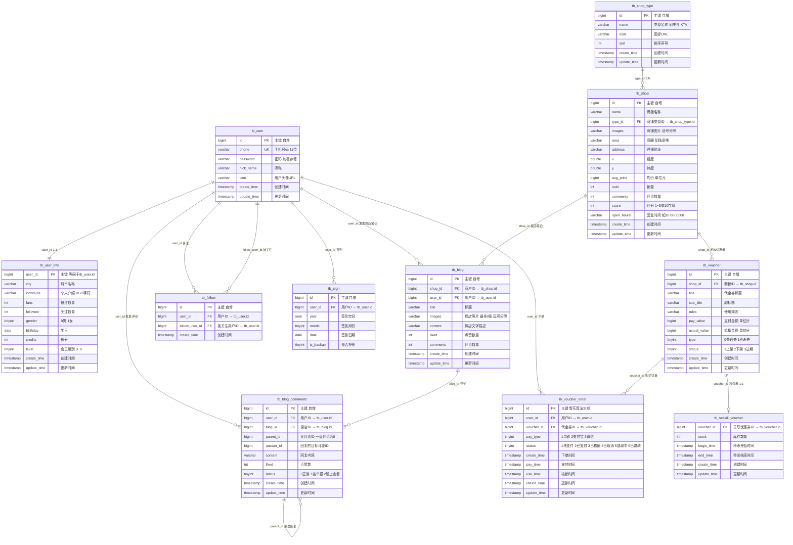

# HMD数据库 ER 图 (大众点评项目)

## 表关系总览 (11 张表)



## 业务关系说明

| 关系 | 类型 | 说明 |
|------|------|------|
| tb_user ↔ tb_user_info | **1:1** | 每个用户有一份详细资料，user_info.user_id = user.id |
| tb_user → tb_blog | **1:N** | 一个用户可发表多篇探店笔记 |
| tb_user → tb_blog_comments | **1:N** | 一个用户可发表多条评论 |
| tb_user → tb_follow | **1:N** | 一个用户可关注多个其他用户 (user_id) |
| tb_user → tb_follow | **1:N** | 一个用户可被多个其他用户关注 (follow_user_id) |
| tb_user → tb_voucher_order | **1:N** | 一个用户可下多个优惠券订单 |
| tb_user → tb_sign | **1:N** | 一个用户有多条签到记录 |
| tb_shop_type → tb_shop | **1:N** | 一个商铺类型下有多个商铺 |
| tb_shop → tb_blog | **1:N** | 一个商铺可被多次探店写笔记 |
| tb_shop → tb_voucher | **1:N** | 一个商铺可发放多种优惠券 |
| tb_blog → tb_blog_comments | **1:N** | 一篇笔记下有多条评论 |
| tb_blog_comments → tb_blog_comments | **自引用 1:N** | 评论支持嵌套回复 (parent_id) |
| tb_voucher → tb_seckill_voucher | **1:1** | type=1的优惠券有秒杀扩展属性 |
| tb_voucher → tb_voucher_order | **1:N** | 一种优惠券可被多次购买 |

## 核心业务流程

```
用户(tb_user) → 浏览商铺(tb_shop by tb_shop_type分类)
              → 写探店笔记(tb_blog) → 评论互动(tb_blog_comments)
              → 关注其他用户(tb_follow)
              → 购买优惠券(tb_voucher_order ← tb_voucher ← tb_seckill_voucher)
              → 每日签到(tb_sign)
```
